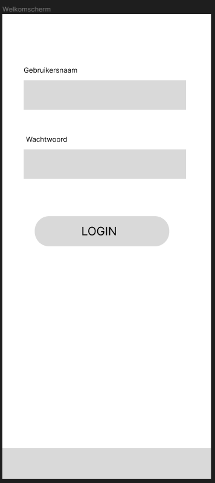
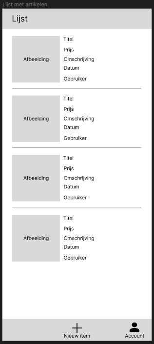
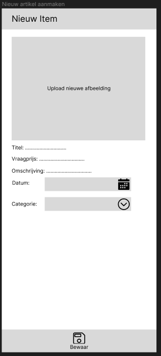
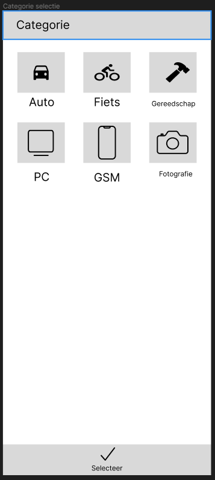
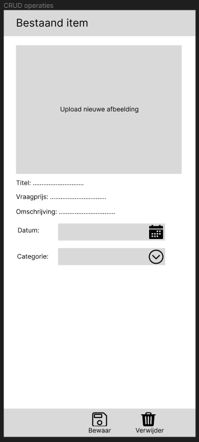

# Permanente evaluatie

**Vul hieronder verder aan zoals beschreven in de opgave.**

## Scherm 1

De gebruiker kan zich registreren of meldt zich aan via een inlogscherm.

## Scherm 2

De gebruiker krijgt een overzicht van alle artikelen die in de applicatie geplaatst zijn en kan hierin navigeren.

## Scherm 3

De gebruiker kan een nieuw artikel plaatsen.
Dit artikel bevat een foto, een titel, een vraagprijs, een omschrijving en een categorie.

## Scherm 4

De gebruiker kan een categorie selecteren waartoe het artikel behoord.

## Scherm 5

De gebruiker kan de geplaatste artikelen aanpassen of verwijderen (CRUD).

## Native modules & Online services

- Foto's nemen
- Authenticatie met behulp van Firebase
- Databank connectie waar de data bewaard wordt

# Feedback

Goede inzending, voldoet aan de vereisten en is eenvoudig genoeg zodat je het zeker af krijgt.

Het enige probleem is dat je slechts één native module beschreven hebt in de plaats van de twee die vereist zijn.
Maar je kan de firebase authentication plug-in gebruiken om de email/password authenticatie te voorzien.

1.9/2

